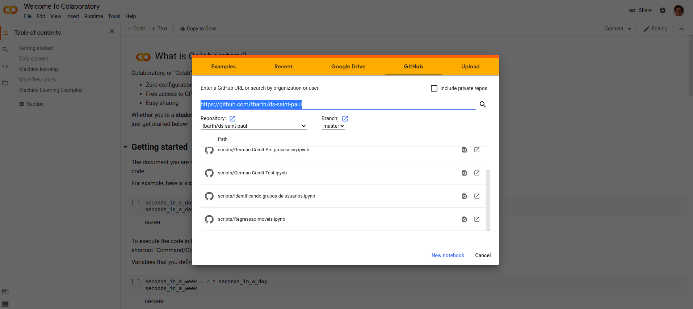

# Data Science, LDR - Saint Paul

Material utilizado no curso de Data Science do programa Leading Digital Reinvention (LDR) da Saint Paul. 

## Objetivos deste material e curso

A prática de Data Science é baseada em um conjunto de metodologias, processos, conceitos e ferramentas. É objetivo deste curso discutir e exercitar tais metodologias, processos, conceitos e ferramentas para que os participantes do curso possam fazer uso da prática de Data Science no seu dia-a-dia. 

Ao compreender melhor a prática de Data Science, espera-se que os participantes do curso possam: 
* identificar potenciais projetos de Data Science; 
* avaliar a complexidade de cada projeto; 
* acompanhar a execução dos projetos; 
* identificar skills relevantes para a formação de equipes de Data Science, e; 
* interagir com profissionais técnicos da área. 

Este curso não tem como objetivo formar engenheiros de machine learning, engenheiros de dados, cientista de dados ou qualquer outro profissional que compreenda em profundidade os algoritmos e ferramentas normalmente empregados no desenvolvimento de modelos preditivos ou descritivos. No entanto, é também objetivo deste curso discutir os conceitos e cenários de utilização dos principais algoritmos da prática de Data Science.

## Programação

* *08:00 – 08:15*:	Apresentação da turma;
* *08:15 – 09:00*:  [Introdução à Aprendizagem de Máquina](slides/02_aIntroducao.pdf) e [Processos para projetos de Data Science](slides/03_bigDataCiencaDadosKDD.pdf); 
* *09:00 – 10:00*:  [Desenvolvendo um modelo preditivo do tipo regressão](scripts/RegressaoImoveis.ipynb);
* *10:00 – 10:20*:  Coffee-Break;
* *10:20 – 12:00*:  [Desenvolvendo um modelo preditivo do tipo classificação](scripts/2021_breast_cancer/README.md);
* *12:00 – 14:00*:  Almoço; 
* *14:00 – 15:40*:  [Desenvolvendo um modelo descritivo do tipo clustering](scripts/identificando_grupos_usuarios.ipynb);
* *15:40 – 16:00*:  Coffee-Break;
* *16:00 – 17:30*:  Projetos de Data Science nas empresas: [[1]](slides/04_kdd_na_empresa.pdf), [[2]](slides/05_etapas_projeto.pdf);
* *17:30 – 18:00*:  Fechamento.

## Ambiente para a execução dos scripts

Para facilitar a execução dos scripts, vamos utilizar um ambiente na nuvem chamado [Colab](https://colab.research.google.com/). Para tanto, siga as etapas descritas abaixo:

* Acesse o link [https://colab.research.google.com/](https://colab.research.google.com/) no seu browser favorito;
* Entre as opções (*Examples*, *Recent*, *Google Drive*, *GitHub* e *Upload*), escolha a opção *GitHub*;
* No campo *GitHub URL* informe a URL do projeto [https://github.com/fbarth/ds-saint-paul](https://github.com/fbarth/ds-saint-paul);
* O resultado destas ações será uma tela parecida com a tela abaixo:



* O próximo passo é selecionar o arquivo `scripts/RegressaoImoveis.ipynb` e abrir como notebook em uma nova aba. 

### Execução em ambiente local

Não é objetivo executar os scripts em ambiente local. No entanto, quem tiver mais familiaridade com GitHub e Python então poderá como atividade extra classe configurar o projeto para execução em máquina local seguindo as próximas etapas: 

* Configurar o ambiente virtual:

````bash
virtualenv venv
source venv/bin/activate
python -m pip install --upgrade pip
pip install -r requirements.txt
````

* Iniciar o ambiente **jupyter lab**:

````bash
jupyter lab
````

* Isto irá fazer com que uma instância do jupyter lab seja aberta no seu browser. A partir do browser você poderá abrir todos os scripts e editá-los. 

## Referências

* Fayyad, U., Piatetsky-Shapiro, G., & Smyth, P. (1996). [From Data Mining to Knowledge Discovery in Databases](references/fay1996.pdf). AI Magazine, 17(3), 37. https://doi.org/10.1609/aimag.v17i3.1230

* Mitchell, T. [The Discipline of Machine Learning. 2006](references/MachineLearning.pdf). http://www.cs.cmu.edu/~tom/pubs/MachineLearning.pdf

* WICKHAM, Hadley. [Tidy Data](references/tidy-data.pdf). Journal of Statistical Software, [S.l.], v. 59, Issue 10, p. 1 - 23, sep. 2014. ISSN 1548-7660. Available at: <https://www.jstatsoft.org/v059/i10>. doi:http://dx.doi.org/10.18637/jss.v059.i10.

* [Foudational Methodology for Data Science. Material que faz parte do curso Data Science Practitioner da plataforma Skills Academy da IBM](references/foundational_ds_ibm.PDF).

* Vasant Dhar. 2013. [Data science and prediction](references/ds_prediction.pdf). Commun. ACM 56, 12 (December 2013), 64–73. DOI:https://doi.org/10.1145/2500499

* Dua, D. and Graff, C. (2019). UCI Machine Learning Repository [http://archive.ics.uci.edu/ml](http://archive.ics.uci.edu/ml). Irvine, CA: University of California, School of Information and Computer Science.

* Anaconda, [2020 State of Data Science Report](references/anaconda_report.pdf).


## Informações adicionais

Este curso foi executado em 2020 e em 2021. O material existente neste repositório é referente a versão 2021. 
