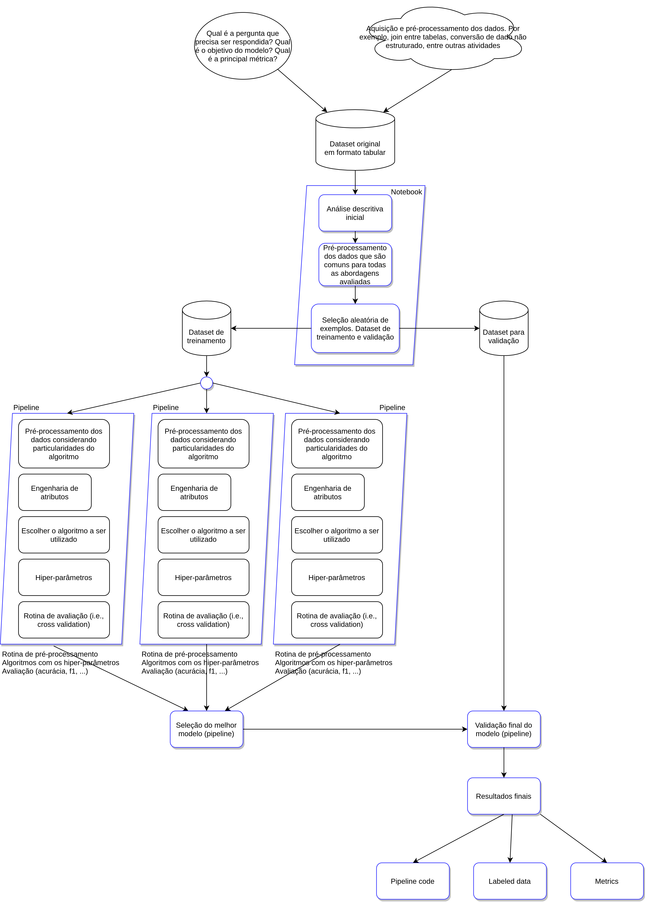

# Identificação de câncer maligno: exemplo de projeto com diversos pipelines

Um projeto de modelo preditivo normalmente é composto pelos seguintes componentes:

E o processo de data science pode ser sumarizado da seguinte forma:

Neste exercício temos uma situação onde a análise descritiva é feita de forma separada dos diversos pipelines testados:

* [Análise Descritiva](exploratoryDataAnalysis.ipynb).
* [Pipeline com KNN]().
* [Pipeline com Gradient Boosting]().
* [Pipeline com Random Forest]().

Analise todos os arquivos debatendo em grupo as seguintes questões:

* O que é possível perceber com a análise descritiva dos dados? 
* Qual é o melhor modelo? 

